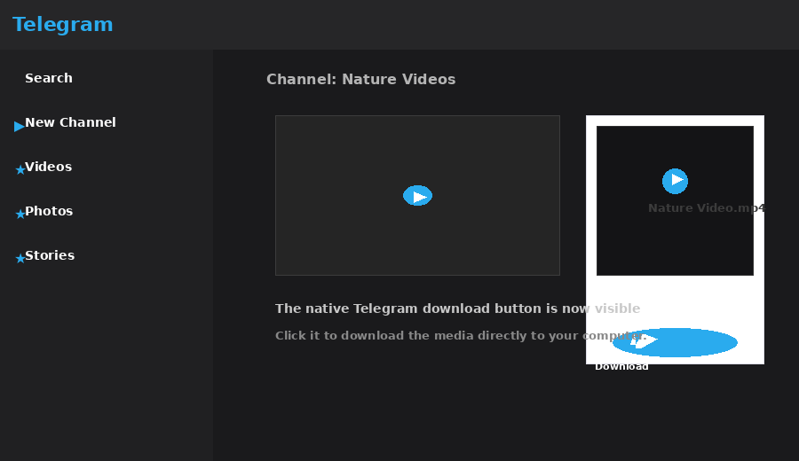
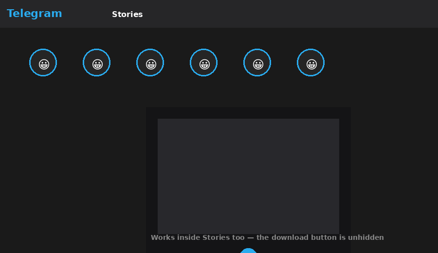

# Telegram Media Downloader

[](LICENSE)
[](manifest.json)
[](https://github.com/VaCris/telegram-web-capture/releases)
[](https://github.com/VaCris/telegram-web-capture/stargazers)
[](https://github.com/VaCris/telegram-web-capture/releases)
[](https://github.com/VaCris/telegram-web-capture/commits)

Una extensión de Chrome que **muestra el botón de descarga nativo de Telegram** cuando abres el visor multimedia y las Stories en Telegram Web. Sin capturar ni almacenar medios: simplemente hace visible el botón que Telegram ya oculta, para que descargues **directamente** con el propio sistema de Telegram.

---

## Table of Contents

- [Demo](#demo)
- [Características](#características--features)
- [Instalación](#instalación--installation)
- [Uso](#uso--usage)
- [Cómo funciona](#cómo-funciona--how-it-works)
- [Estructura del proyecto](#estructura-del-proyecto--project-structure)
- [Desarrollo](#desarrollo--development)
- [Compatibilidad](#compatibilidad--compatibility)
- [Contribuir](#contribuir--contributing)
- [Licencia](#licencia--license)

---

## Demo

### Media viewer

The native Telegram download button is unhidden in the media viewer so you can download videos, photos, audio, and documents instantly.



### Stories

The same behaviour applies inside the Stories viewer.



---

## Características / Features

| | |
|---|---|
| ✅ | **Unhide native download** — shows Telegram Web's hidden download button in the media viewer. |
| ✅ | **Works in Stories** — also unhides the download button when viewing Stories. |
| ✅ | **All media types** — videos, audios, images and documents. |
| ✅ | **No media capture/storage** — nothing is intercepted or saved; you download directly from Telegram's CDN. |
| ✅ | **No configuration needed** — install and it just works. |
| ✅ | **Manifest V3** — built on the modern Chrome extension platform. |
| ✅ | **Lightweight** — runs a minimal content script that polls the DOM every 500 ms. |

---

## Instalación / Installation

### Option A — Manual (unpacked extension)

Ideal para probar la última versión de `main`.

1. Descarga el [último release](https://github.com/VaCris/telegram-web-capture/releases) y descomprime el ZIP, **o** clona el repositorio:
   ```bash
   git clone https://github.com/VaCris/telegram-web-capture.git
   ```
2. Abre Chrome y navega a `chrome://extensions/`.
3. Activa **Modo desarrollador** (esquina superior derecha).
4. Haz clic en **Cargar extensión sin empaquetar**.
5. Selecciona la carpeta del proyecto (`telegram-web-capture`).
6. La extensión aparecerá en tu barra de herramientas.

> **Edge / Brave / Opera** — estos navegadores también soportan extensiones de Chrome. Activa la opción de extensiones desbloqueadas desde `edge://extensions/` y sigue los mismos pasos.

### Option B — Chrome Web Store (próximamente)

Once published to the [Chrome Web Store](https://chromeweb.google.com/), you'll be able to install it with a single click — keep an eye on the releases page.

---

## Uso / Usage

1. Abre [Telegram Web](https://web.telegram.org) e inicia sesión.
2. Navega por tus chats, canales o grupos.
3. Haz clic en cualquier video, imagen, audio o documento para abrir el **visor multimedia**.
4. El botón de descarga que Telegram oculta (normalmente en la esquina inferior derecha) **aparecerá automáticamente**.
5. Haz clic en ese botón (💾) para descargar el archivo directamente a tu carpeta de descargas.

That's it — no popup interaction required. The extension works in the background by toggling a CSS class on the native buttons.

### Stories

1. Reproduce o abre una Story.
2. El botón de descarga también aparecerá visible en el visor de Stories.

---

## Cómo funciona / How it works

Telegram Web already includes a native download button inside its media viewer and Stories viewer — but it is hidden via the CSS class `hide` (i.e. `display: none`).

This extension injects a lightweight [content script](content/content.js) that periodically scans the DOM for `.media-viewer-whole` and the `#stories-viewer` containers. When it finds buttons with the `hide` class inside `.media-viewer-buttons`, it **removes the `hide` class**, making the native download button visible again.

Because it reuses Telegram's own download mechanism, there is:

- ❌ No reverse-engineering of private APIs.
- ❌ No interception of network requests for media capture.
- ❌ No local storage of your downloads.
- ✅ A privacy-friendly, source-available solution.

The [background script](background/background.js) exists to support download-URL resolution via `chrome.webRequest`, and listens for download messages — but the primary mechanism is the native button unhide.

---

## Estructura del proyecto / Project structure

```
telegram-web-capture/
├── manifest.json            # Chrome extension manifest (MV3)
├── background/
│   └── background.js        # Background service worker
├── content/
│   ├── content.js           # Content script — unhides native download buttons
│   └── content.css          # Styles for any injected elements
├── popup/
│   ├── popup.html           # Popup markup
│   ├── popup.css            # Popup styles
│   └── popup.js             # Popup logic
├── icons/
│   ├── icon.svg             # Source vector icon
│   ├── icon16.png           # 16×16  (toolbar)
│   ├── icon48.png           # 48×48  (extension manager)
│   └── icon128.png          # 128×128 (Chrome Web Store)
├── docs/
│   ├── index.html           # Landing page (GitHub Pages)
│   ├── screenshots/         # Promotional screenshots
│   └── assets/              # Landing page assets
├── README.md                # This file
├── TESTING.md               # Manual testing guide
├── CHANGELOG.md             # Changelog
└── LICENSE                  # Apache License 2.0
```

---

## Desarrollo / Development

1. Clonea el repositorio:
   ```bash
   git clone https://github.com/VaCris/telegram-web-capture.git
   cd telegram-web-capture
   ```
2. Carga la extensión sin empaquetar en `chrome://extensions/` (ver [Instalación](#instalación--installation)).
3. Haz cambios en los archivos de `content/`, `background/` o `popup/`.
4. Recarga la extensión desde `chrome://extensions/` pulsando el botón de recargar.

### Testing

See [TESTING.md](TESTING.md) for the manual testing guide.

### Creating a release ZIP

Para generar el paquete ZIP listo para cargar como extensión sin empaquetar:

```bash
zip -r telegram-web-capture-1.0.2.zip \
    manifest.json \
    background/ \
    content/ \
    popup/ \
    icons/ \
    README.md \
    LICENSE
```

---

## Compatibilidad / Compatibility

| Navegador | Estado |
|-----------|--------|
| Google Chrome (desktop) | ✅ Compatible |
| Microsoft Edge (Chromium) | ✅ Compatible |
| Brave (desktop) | ✅ Compatible |
| Opera (desktop) | ✅ Compatible* |
| Firefox | ❌ No (MV3 / WebExtensions differences) |

\* Opera requires [the "Install Chrome Extension" add-on](https://addons.opera.com/en/extensions/details/install-chrome-extensions/).

---

## Contribuir / Contributing

¡Las contribuciones son bienvenidas! Por favor:

1. Abre un *issue* describiendo el problema o la mejora.
2. Haz *fork* del repositorio y crea una rama con tu cambio.
3. Abre un *pull request* describiendo los cambios.

### Notas para contribuidores

- Telegram Web cambia su estructura DOM regularmente. Si la extensión deja de funcionar, revisa y actualiza los selectores en `content/content.js` (`scanMediaViewer` y `scanStories`).
- Mantén el manifest en `manifest_version: 3`.
- Sigue el estilo de código existente (sin transpilador, ES6+).

---

## Licencia / License

This project is licensed under the **Apache License 2.0** — see [LICENSE](LICENSE) for details.

### Attribution requirement

As specified in the license, **any fork, derivative work, or redistribution of this software must include prominent attribution** to the original author:

> Original work by Bryan Alexander Vidal Crispin
> https://github.com/VaCris/telegram-web-capture

This attribution must be visible in:
- The project's README.md or similar documentation.
- Any published distribution (GitHub releases, npm, etc.).
- The source code headers of modified files.

---

*Diseñado y mantenido por [Bryan Alexander Vidal Crispin](https://github.com/VaCris).*
