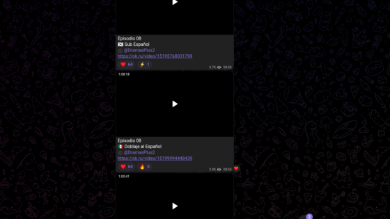
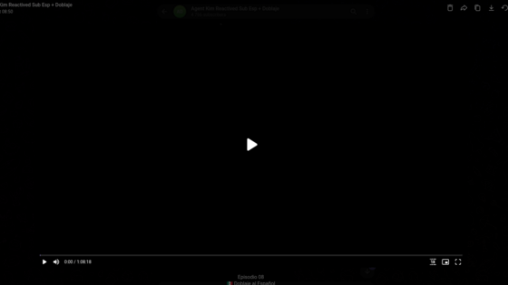
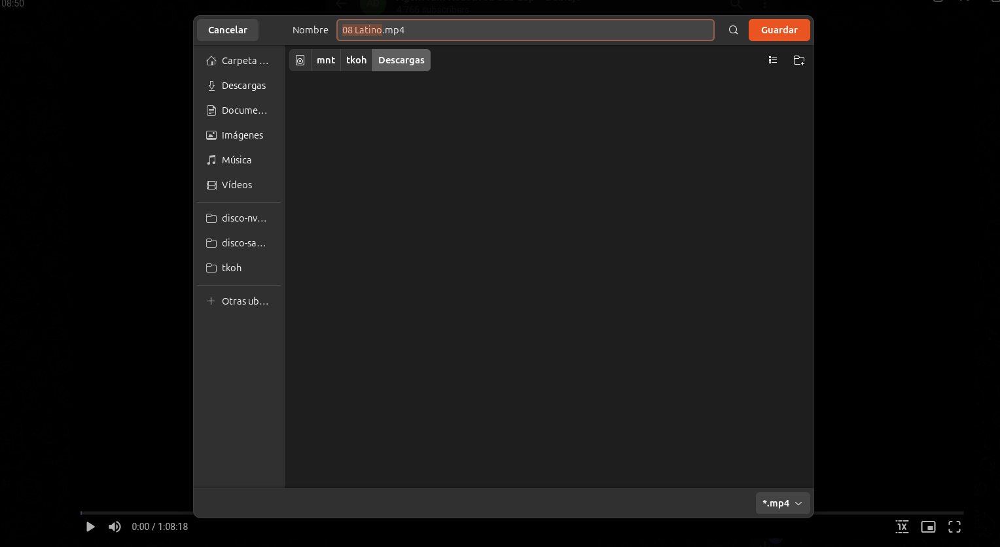

<h1 align="center">Telegram Media Downloader</h1>

<p align="center">
  <a href="LICENSE">
    
  </a>
  <a href="manifest.json">
    
  </a>
  <a href="https://github.com/VaCris/telegram-web-capture/releases">
    
  </a>
  <a href="https://github.com/VaCris/telegram-web-capture/stargazers">
    
  </a>
</p>

<p align="center">
  🇺🇸 <a href="README.md">English</a> · 🇪🇸 <strong>Español</strong>
</p>

Telegram Media Downloader es una extensión ligera para Chrome que hace visible el **botón de descarga nativo de Telegram Web** dentro del visor multimedia y del visor de Stories.

La extensión no captura, redirige ni almacena archivos multimedia. Su función es retirar el estado oculto de los controles que ya existen en Telegram Web para que la descarga continúe usando el mecanismo original de Telegram.

## Características

- Muestra el botón de descarga nativo de Telegram Web.
- Funciona en el visor multimedia y en Stories.
- Compatible con los medios gestionados por el visor de Telegram, como imágenes, videos, audios y documentos.
- No intercepta las peticiones de los archivos ni almacena el contenido descargado.
- No requiere configuración.
- Construida con Chrome Extension Manifest V3.
- Content script ligero basado en `MutationObserver`, sin sondeos y sin coste en reposo.
- Popup en la barra de herramientas con interruptor on/off, estado de conexión y acceso directo a Abrir Telegram.

## Instalación

### Desde un release

1. Abre la página de [Releases](https://github.com/VaCris/telegram-web-capture/releases).
2. Descarga el ZIP de la versión más reciente.
3. Extrae el contenido en una carpeta.
4. Abre `chrome://extensions/`.
5. Activa **Modo desarrollador**.
6. Haz clic en **Cargar extensión sin empaquetar**.
7. Selecciona la carpeta extraída.

### Desde el código fuente

```bash
git clone https://github.com/VaCris/telegram-web-capture.git
cd telegram-web-capture
```

Después abre `chrome://extensions/`, activa **Modo desarrollador**, selecciona **Cargar extensión sin empaquetar** y elige la carpeta del repositorio.

Los navegadores basados en Chromium, como Microsoft Edge y Brave, normalmente pueden cargar la extensión mediante el mismo flujo.

## Uso

1. Abre [Telegram Web](https://web.telegram.org) e inicia sesión.
2. Entra a un chat, grupo o canal.
3. Abre una imagen, video, audio, documento o Story.
4. La extensión revisará el visor activo de Telegram y hará visibles los controles ocultos.
5. Pulsa el botón de descarga de Telegram para guardar el archivo mediante el flujo normal de la plataforma.

Al pulsar el icono de la barra de herramientas se abre el popup: indica si la pestaña activa es Telegram Web, permite activar o desactivar la extensión y ofrece un acceso directo a Abrir Telegram.

### Capturas







## Cómo funciona

Telegram Web puede mantener ocultos algunos controles nativos del visor mediante la clase `hide`.

La extensión inyecta `content/content.js`, que observa la página con un `MutationObserver` y revisa:

- `.media-viewer-whole` y sus `.media-viewer-buttons`
- `#stories-viewer`

Cuando encuentra botones ocultos del visor, elimina la clase `hide` para que los controles propios de Telegram (descarga, menú de calidad, copiar y demás) estén accesibles. Los botones relacionados con descarga también se marcan con `tgico-download`.

Por este motivo, la extensión no necesita aplicar ingeniería inversa sobre APIs privadas de Telegram ni implementar un descargador independiente.

## Estructura del proyecto

```text
telegram-web-capture/
├── manifest.json
├── _locales/
│   ├── en/
│   └── es/
├── content/
│   └── content.js
├── popup/
│   ├── popup.html
│   ├── popup.css
│   └── popup.js
├── icons/
├── docs/
│   └── screenshots/
├── tests/
│   └── content.test.js
├── scripts/
│   └── package.sh
├── package.json
├── README.md
├── README_ES.md
├── TESTING.md
├── TESTING_ES.md
├── CHANGELOG.md
├── CHANGELOG_ES.md
├── LICENSE
└── .gitignore
```

## Desarrollo

La extensión actual no requiere un paso de compilación.

1. Clona el repositorio.
2. Carga el repositorio como extensión sin empaquetar.
3. Modifica los archivos necesarios.
4. Recarga la extensión desde `chrome://extensions/`.
5. Actualiza Telegram Web y verifica el flujo afectado.

Ejecuta los tests automatizados del content script con:

```bash
npm install
npm test
```

Genera un zip de release limpio (solo archivos de la extensión — excluye `node_modules`, tests, docs y metadatos de git):

```bash
npm run package
```

El archivo queda en `dist/`. Para pruebas manuales consulta [TESTING_ES.md](TESTING_ES.md).

## Compatibilidad

| Navegador | Estado |
| --- | --- |
| Google Chrome (desktop) | Compatible |
| Microsoft Edge (Chromium) | Se espera que funcione |
| Brave (desktop) | Se espera que funcione |
| Otros navegadores Chromium | Puede funcionar |
| Firefox | No es un objetivo actual |

La compatibilidad puede cambiar cuando Telegram Web modifica su estructura DOM.

## Contribuir

Las contribuciones son bienvenidas.

1. Abre un issue describiendo el problema o mejora.
2. Haz fork del repositorio.
3. Crea una rama enfocada en el cambio.
4. Envía un pull request con una descripción clara.

Si Telegram modifica el DOM de su visor multimedia, puede ser necesario actualizar los selectores en `content/content.js`.

## Privacidad

La implementación actual no captura ni persiste contenido multimedia de Telegram. Solo actúa sobre la interfaz existente de Telegram Web para mostrar controles que ya están presentes en la página.

Puedes revisar `manifest.json` y el código fuente antes de instalarla para verificar sus permisos y comportamiento.

## Licencia

Este proyecto está licenciado bajo [Apache License 2.0](LICENSE).

Trabajo original de **Bryan Alexander Vidal Crispin**  
https://github.com/VaCris/telegram-web-capture

## Enlaces

- [Releases](https://github.com/VaCris/telegram-web-capture/releases)
- [Historial de cambios](CHANGELOG_ES.md)
- [Guía de pruebas](TESTING_ES.md)
- [Landing page](https://vacris.github.io/telegram-web-capture/)
